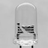

[](https://github.com/cliffano/usbled/actions?query=workflow%3ACI)

# USBLED Standalone

USBLED Standalone is a USB LED Linux device driver for stand-alone kernel insertion.

The driver code is exactly the same as the original code written by [Greg Kroah-Hartman](http://kroah.com/log/) from its addition into the kernel in 2004.

USB LED driver was [removed from the kernel in 2016](https://patchwork.kernel.org/project/linux-input/patch/bc0c4bbd-d65d-eeb8-ed13-20bdb4cea6df@gmail.com/), hence the need to build and insert USB LED driver as a stand-alone in order to support old USB LED devices (Delcom Visual Signal Indicator, Riso Kagaku LED, Dream Cheeky Webmail Notifier) on the more modern kernel versions.

## Installation

Ensure kernel headers package is installed:

```text
# On Debian
apt-get install linux-headers

# On Raspberry Pi OS
apt-get install raspberrypi-kernel-headers
```

Download DKMS Debian package from [Releases page](https://github.com/cliffano/usbled-standalone/releases):

```shell
curl -O https://github.com/cliffano/usbled-standalone/releases/download/1.1.0/usbled-standalone-dkms_1.1.0-1_all.deb
```

Then install the DKMS package:

```shell
apt install usbled-standalone-dkms_1.1.0-1_all.deb
```

Alternatively, you can compile the driver:

```shell
make build
```

Insert the driver into the kernel:

```text
sudo make install
```

Alternatively, you can also build a DKMS Debian package:

```text
sudo make deps-deb
make build-deb
```

Install the DKMS package:

```text
sudo make install-deb
```

## Usage

After plugging the USB LED device, you'll find the colour files `red`, `green`, `blue` under `/sys/bus/usb/drivers/usbled/<id>/` directory.

Each of those colour files has the initial value of `0`, indicating the colour is switched off.

Changing the value from `0` to `1` switches the colour on, which should then be visible on the device.

## FAQ

*Q: Why does `/sys/bus/usb/drivers/usbled/` not exist after installing the DKMS package?*

A: You have to plug the USB LED device first, then you'll find the path.
